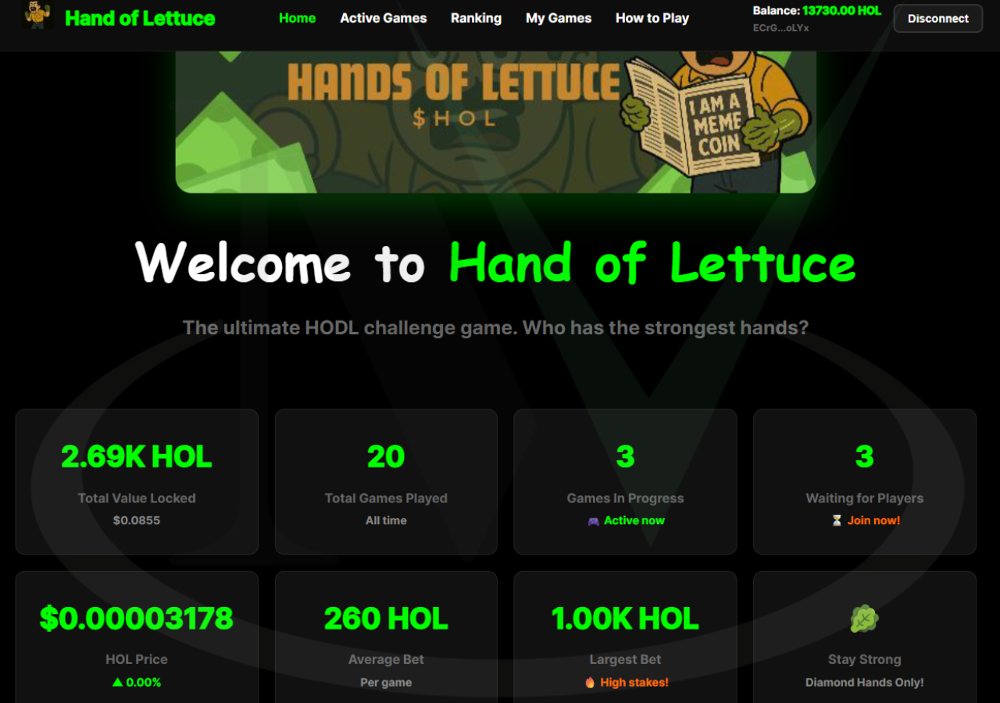
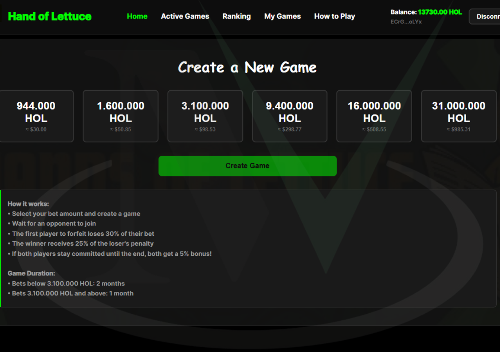
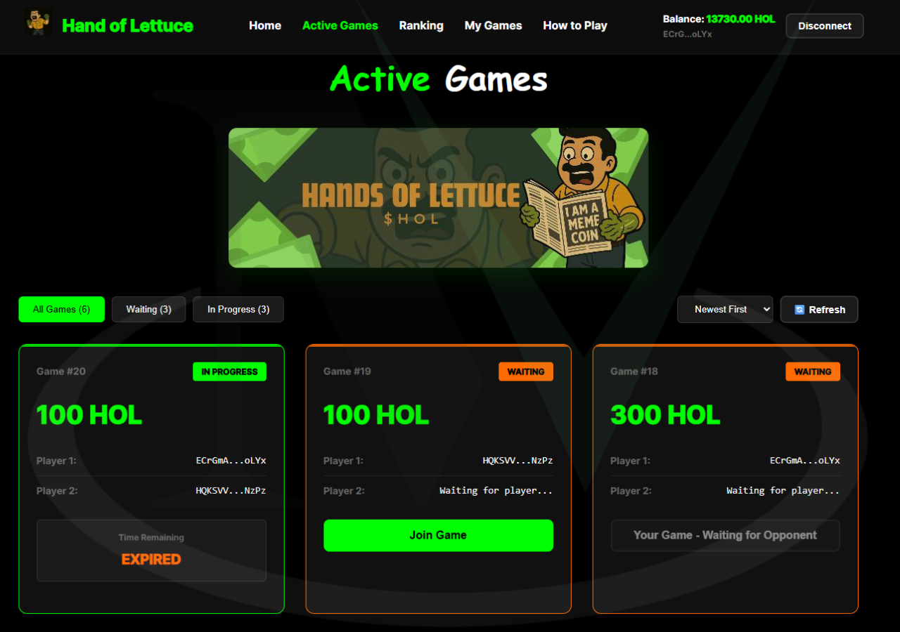
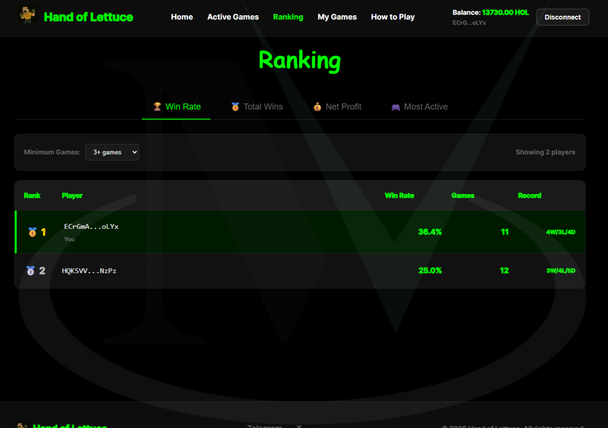
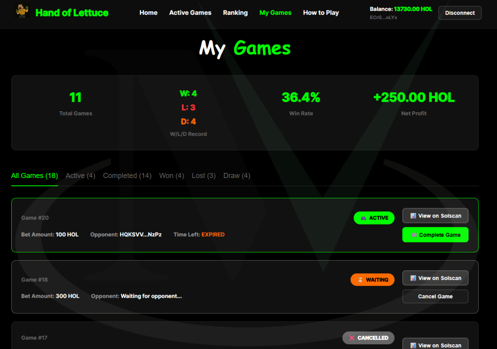
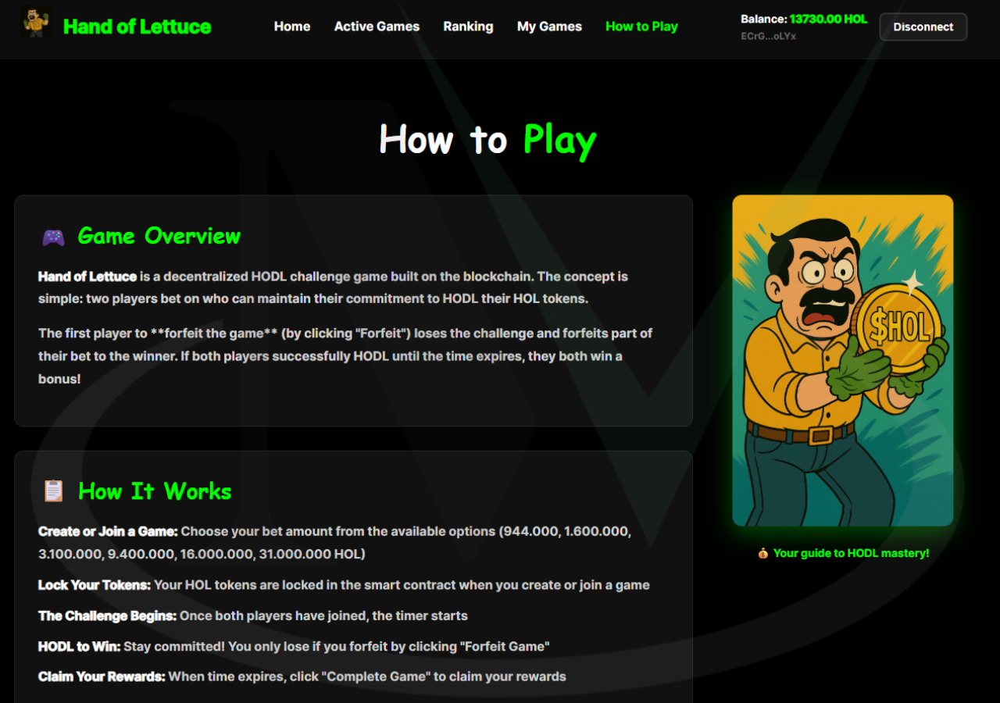
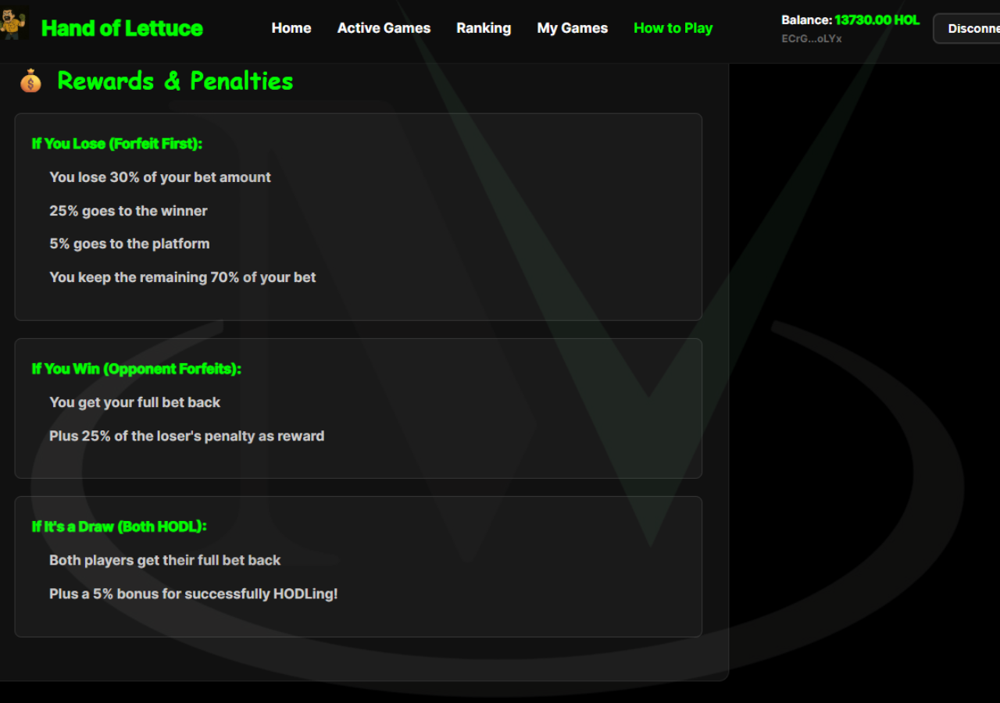
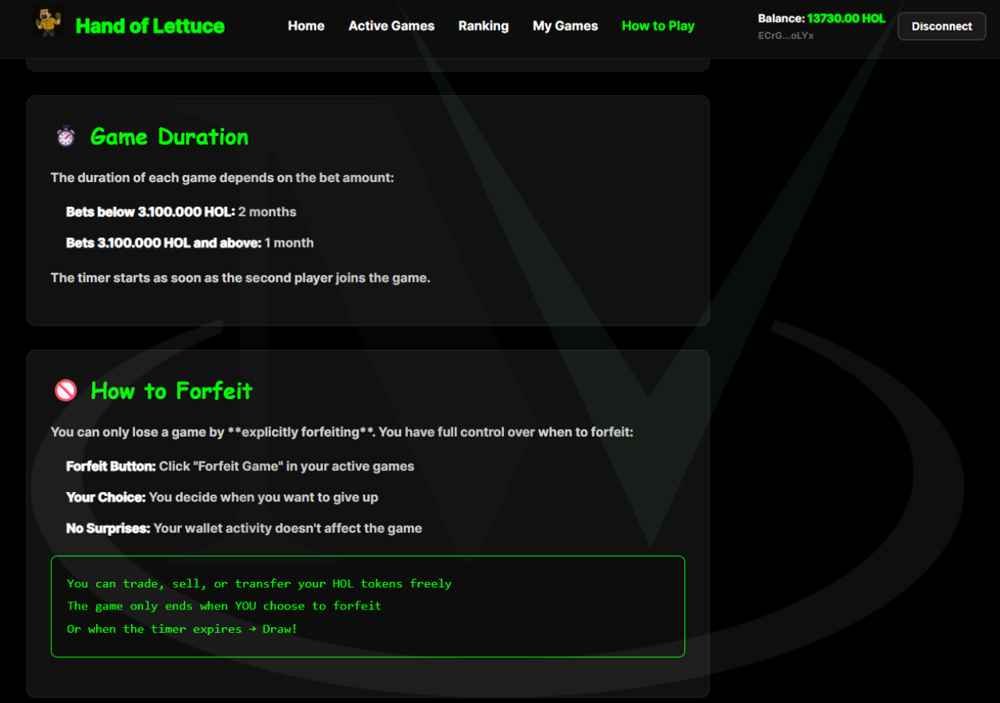
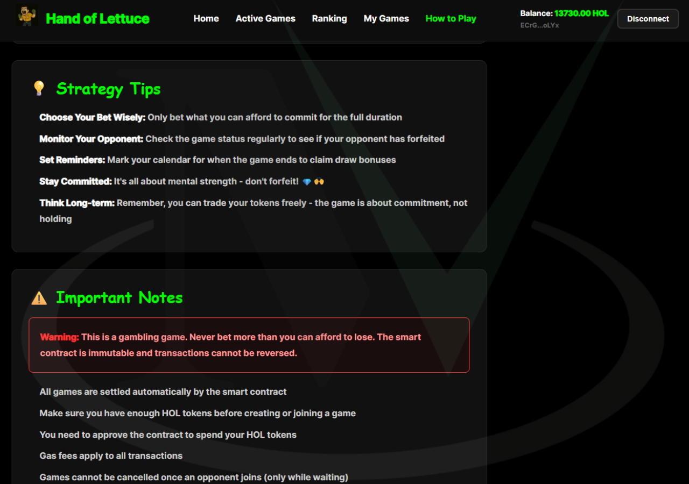

  <!-- Idiomas: -->
  <a title="English" href="README.md">🇺🇸 English</a>

# Hand of Lettuce 🥬

**Hand of Lettuce** é um jogo Web3 descentralizado construído na blockchain Solana onde dois jogadores apostam em quem consegue HODL seus tokens HOL por mais tempo sem vender.

---

## Funcionalidades ✨

- **Desafio HODL** 🎯: Jogadores competem para segurar tokens sem vender
- **Primeiro a Vender Perde** ❌: Primeiro jogador que transferir/vender tokens perde o jogo
- **Contrato Inteligente** 🔒: Todos os fundos são mantidos e distribuídos automaticamente pelo contrato inteligente
- **Múltiplos Valores de Aposta** 💰: Configurável (padrão: 30, 50, 100, 300, 500, 1000 tokens)
- **Sistema de Duração Dinâmico** ⏱️: Durações configuráveis baseadas no valor da aposta
- **Sistema de Tesouro** 🏦: Taxas da plataforma acumulam no tesouro para financiar bônus de empate

---

## Tecnologias Utilizadas 🛠️

### Blockchain
- **Solana** ⚡: Blockchain de alta performance para contratos inteligentes
- **Anchor Framework** ⚓: Framework para desenvolvimento de programas Solana
- **SPL Token** 🪙: Padrão de token nativo da Solana
- **Web3.js** 🌐: Biblioteca JavaScript para interação com blockchain

### Frontend
- **React 18** ⚛️: Framework JavaScript para interfaces de usuário interativas
- **Styled Components** 💅: CSS-in-JS para estilização de componentes
- **Anchor Client** 🔗: Cliente JavaScript para interação com programas Anchor
- **Solana Wallet Adapter** 👛: Integração com múltiplas carteiras Solana

### Smart Contract
- **Rust** 🦀: Linguagem de programação para desenvolvimento de contratos Solana
- **Anchor** ⚓: Framework que simplifica o desenvolvimento de programas Solana
- **Token Program** 💎: Programa nativo da Solana para operações com tokens

---

## Mecânicas do Jogo 🎮

### Economia do Jogo
- **Penalidade do Perdedor**: 30% do valor da aposta
- **Recompensa do Vencedor**: 25% da penalidade do perdedor
- **Taxa da Plataforma**: 5% da penalidade do perdedor
- **Bônus de Empate**: 5% de bônus para ambos os jogadores se ambos HODLarem até o fim

### Fluxo do Jogo
1. **Criação**: Jogador cria jogo e deposita tokens
2. **Entrada**: Segundo jogador se junta ao jogo
3. **Ativo**: Contrato monitora transferências de tokens
4. **Conclusão**: Primeiro a transferir tokens perde automaticamente

---

## Autores 👥

- **@miltonvo** 👨‍💻: Desenvolvedor principal e responsável pela arquitetura do projeto

---

## Demonstração 📺

|  |  |  |
|:-------------------------:|:-------------------------:|:-------------------------:|
|  |  |  |
|  |  |  |

### Vídeo Demonstração 🎥

🔗 **Conteúdo clicável abaixo** ⬇️

---

📄 Case completo no site da MV Dev Solutions: [https://mvdevsolutions.com.br/projetos/hand-of-lettuce](https://mvdevsolutions.com.br/projetos/hand-of-lettuce)
